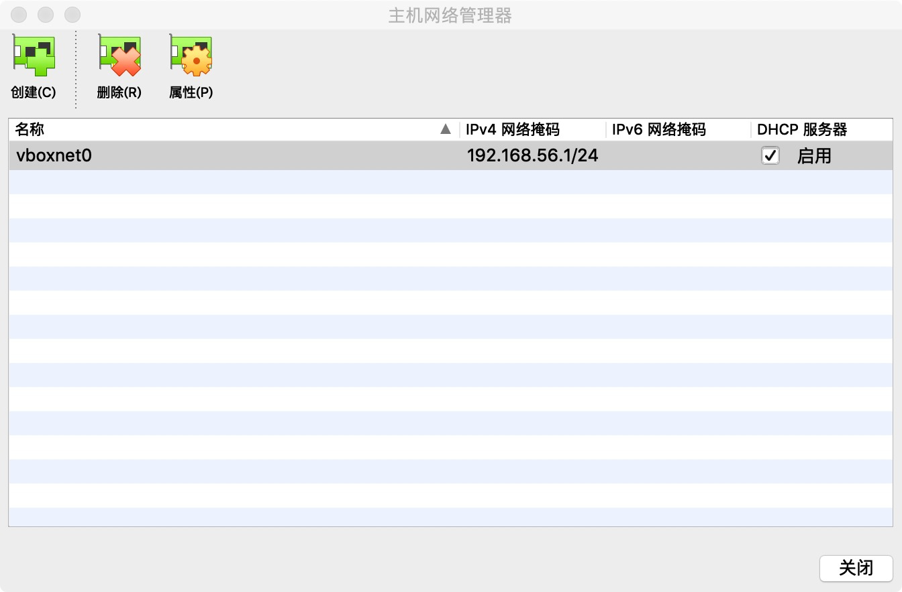
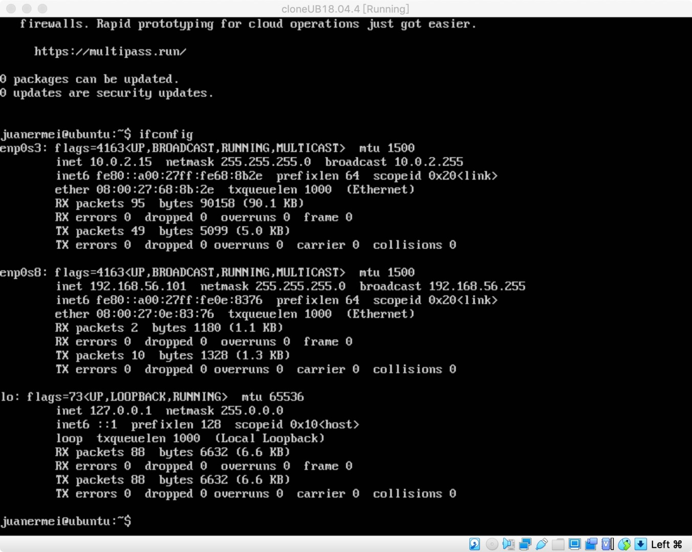
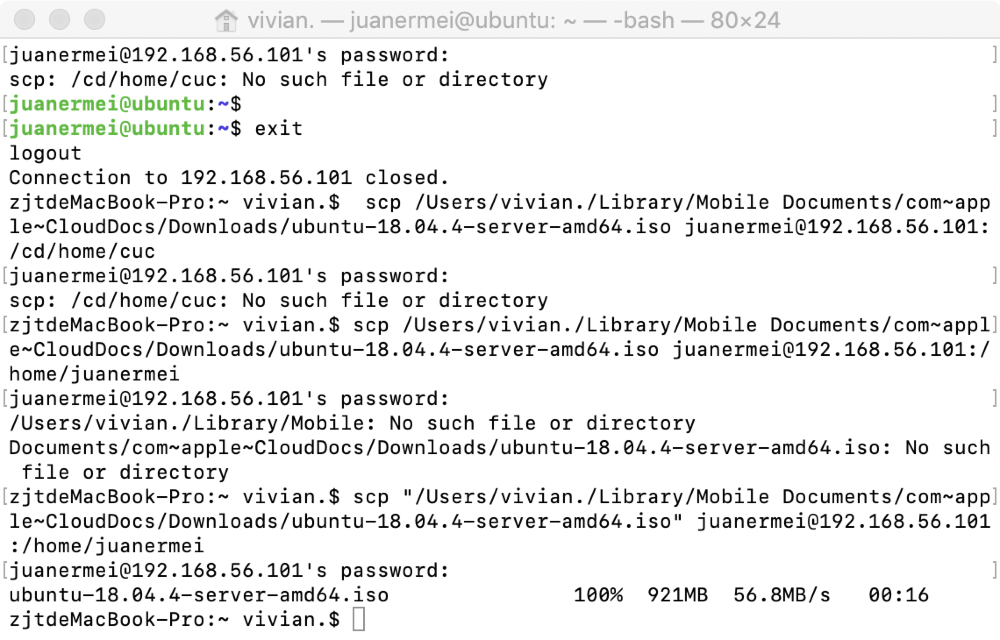
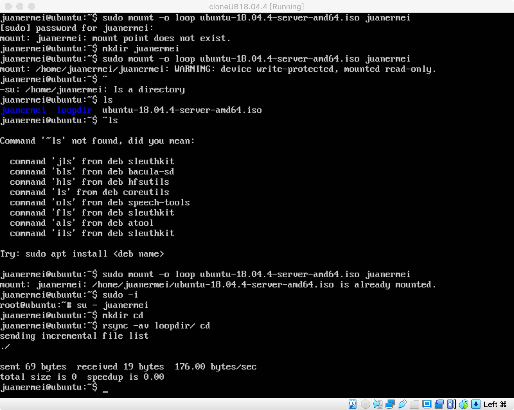
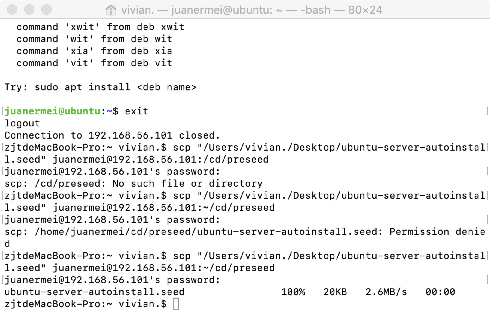
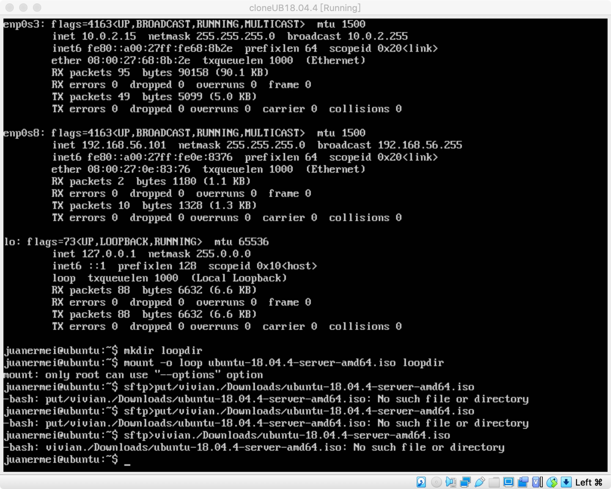
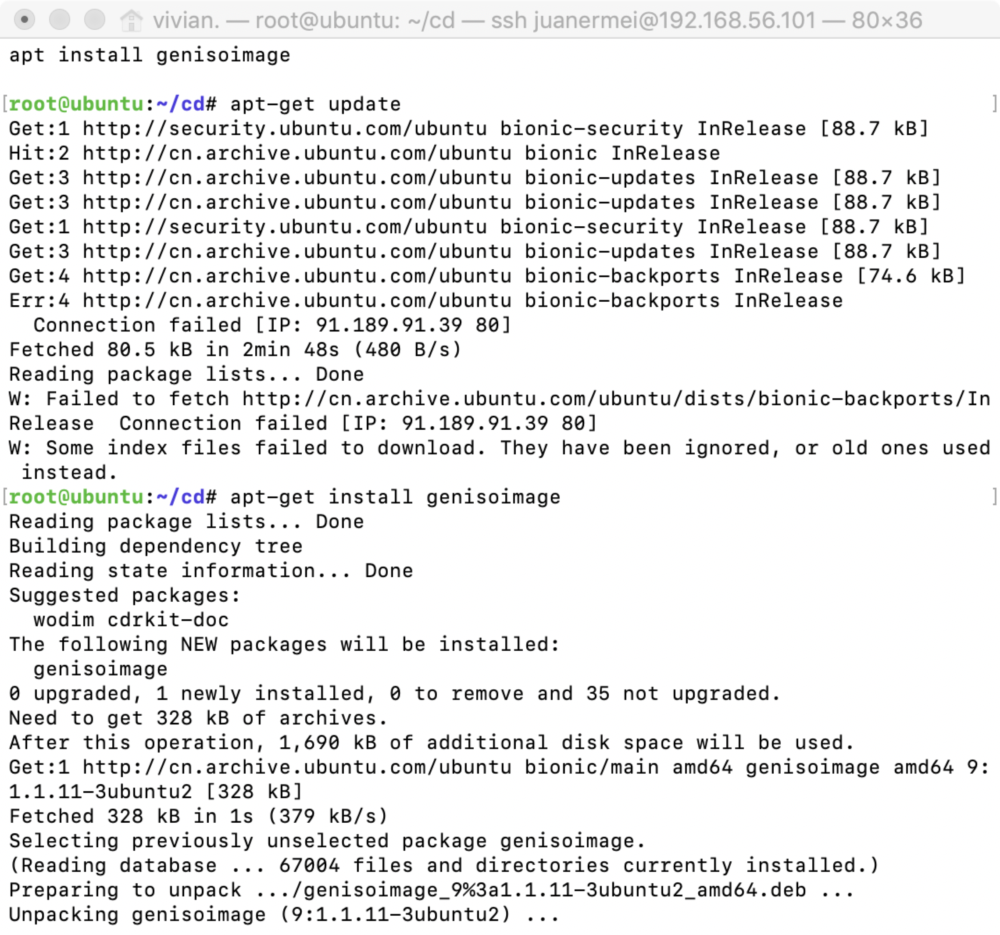
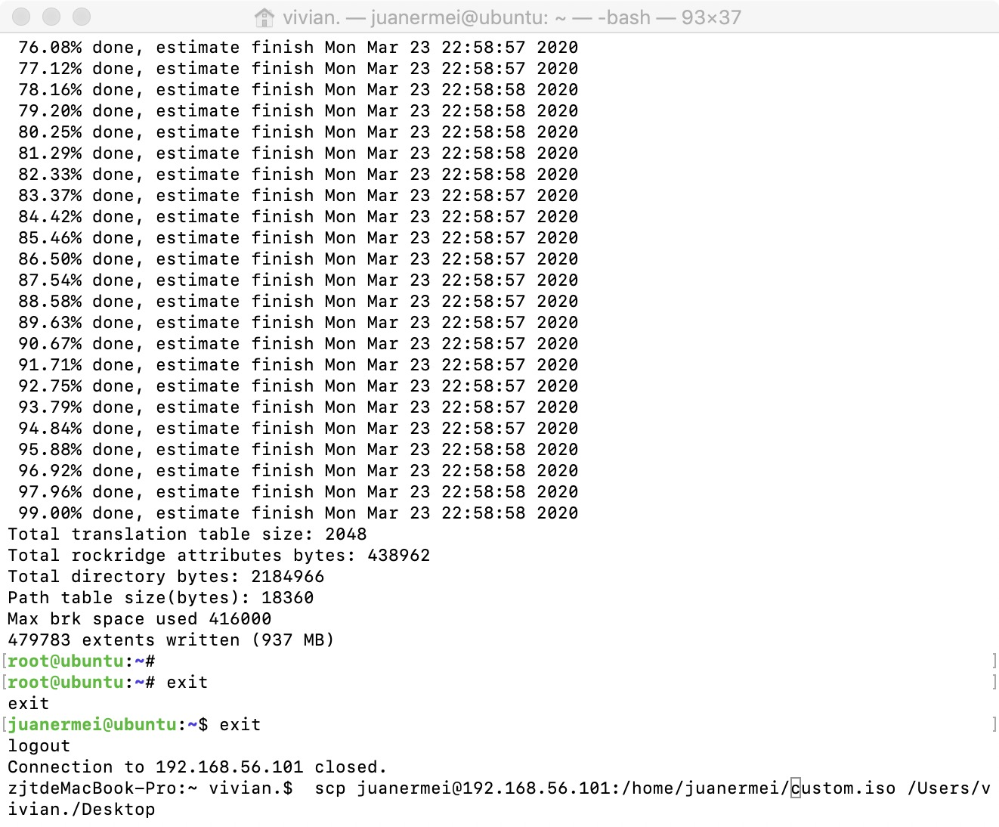

# 实验一：无人值守Linux安装镜像制作
## 实验名称：
> 无人值守Linux安装镜像制作

## 实验要求：
> 定制用户名和默认密码、定制安装OpenSSH Server、安装过程禁止自动联网更新软件包等

## 实验环境：
> Ubuntu-18.04.4-server-amd64、Host-only+NAT、Mac terminal

## 实验步骤：
> 【安装过程8倍速视频链接】：
> 
>(由于视频还在审核，附上我个人主页的url)
>https://space.bilibili.com/388486219
>

>1.在virtualbox的主机管理器里增加一块网卡

>2.启动cloneUB18.04.4，启用第二块网卡

>3.得到第二块网卡的ip为：`192.168.56.101`

>4.更新资源列表并安装openssh-server

>5.在终端登陆ssh，成功后退出到mac终端界面。用`scp "/Users/vivian./Library/Mobile Documents/com~apple~CloudDocs/Downloads/ubuntu-18.04.4-server-amd64.iso" juanermei@192.168.56.101:/home/juanermei`上传iso文件到服务器。

>6.挂载iso镜像文件到所上传的文件并创建工作目录，同步光盘内容到目标工作目录。

>7.卸载iso镜像并进入目标工作目录

>8.编辑Ubuntu安装引导界面增加一个新菜单项入口，添加以下内容到文件开头后保存退出。
`label autoinstall
  menu label ^Auto Install Ubuntu Server
  kernel /install/vmlinuz
  append  file=/cdrom/preseed/ubuntu-server-autoinstall.seed debian-installer/locale=en_US console-setup/layoutcode=us keyboard-configuration/layoutcode=us console-setup/ask_detect=false localechooser/translation/warn-light=true localechooser/translation/warn-severe=true initrd=/install/initrd.gz root=/dev/ram rw quiet`
  
>9.将`ubuntu-server-autoinstall.seed`通过scp上传到“～/cd/preseed”

>10.修改isolinux/isolinux.cfg，将timeout 300改为timeout 10

>11.重新生成md5sum.txt

>12.封闭改动后的目录到.iso并打包下载到本地

>13.新建虚拟机ubuntu18.04.4无人值守，分配光驱custom.iso后启动，进行无人值守安装。

## 遇到的问题及解决方案：
> 1.在配置第二块网卡时无法指定网络界面从而无法启用第二块网卡
> 
> 解决方案：在主机网络管理器中增加了一块网卡，从而成功启用第二块网卡。
> 参考资料：https://www.jianshu.com/p/81969525835f

> 2.在上传iso到服务器时找不到文件
> 
> 解决方案：安装openssh-server后启动登陆ssh，输入命令`scp "/Users/vivian./Library/Mobile Documents/com~apple~CloudDocs/Downloads/ubuntu-18.04.4-server-amd64.iso" juanermei@192.168.56.101:/home/juanermei`成功上传。
> 
> 参考资料：
> https://jingyan.baidu.com/article/54b6b9c08ff5c42d583b473c.html
https://blog.csdn.net/netlai/article/details/79756260

>3.在编辑txt.cfg时由于错误输入路径创建新文件而误以为文件内容丢失
>
>解决方案：当前所在是~  文件完整的路径是~/cd/isolinux/txt.cfg   所以并不是文件内容丢失，而是路径有误。

>4.在输入如下命令后报错
>
>`mkisofs -r -V "Custom Ubuntu Install CD" \
            -cache-inodes \
            -J -l -b isolinux/isolinux.bin \
            -c isolinux/boot.cat -no-emul-boot \
            -boot-load-size 4 -boot-info-table \
            -o $IMAGE $BUILD`
>
>解决方案：照着提示先
>`apt-get update`
>
>然后
>`apt-get install genisoimage`
>
>这样在虚拟机（/home/juanermei/cd/）这个目录下就会出现custom.iso这个镜像

参考资料：
https://blog.csdn.net/qq_31989521/article/details/58600426

>5.在无人值守时卡住报错，由于改写文件添加了错误的seed文件名称，修改好后又忘了重新打包下载iso文件,后来重新下载文件时由于重新打包时变更了所在目录而输入错误的下载文件地址路径。
>
>解决方案：将错误的文件名称用vim修改后，重新打包下载iso文件，并查询custom.iso打包的路径，并重新启动虚拟机。
