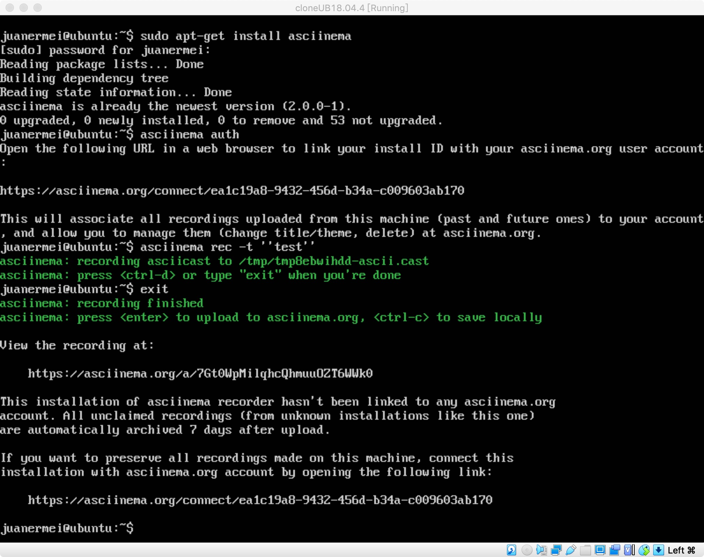
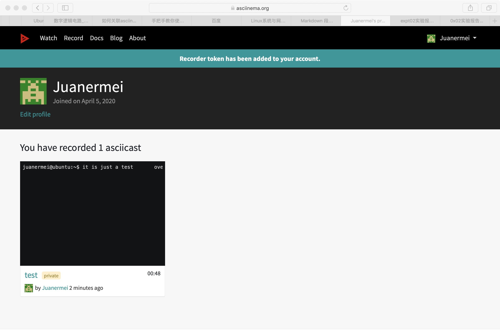

# 实验二：学习vimtutor
## 实验名称：学习vimtutor


## 实验要求：
> 确保本地已经完成asciinema auth，并在asciinema成功关联了本地账号和在线账号；  
上传本人亲自动手完成的vimtutor操作全程录像；  
在自己的github仓库上新建markdown格式纯文本文件附上asciinema的分享URL；  
提醒：避免在终端操作录像过程中暴漏密码、个人隐私等任何机密数据。
***  

## 实验环境：
> Ubuntu 18.04.4 Server 64bit  
在asciinema注册一个账号，并在本地安装配置好asciinema
***
## 实验步骤：
### 一.安装asciinema  
```json
sudo apt-get install asciinema  
sudo apt-add-repository ppa:zanchey/asciinema  
sudo apt-get update
```
>- 在Ubuntu服务器中安装asciinema  

>- 在asciinema成功关联本地账号和在线账号  

（*由于已经安装好了asciinema并且关联成功，所以用上传一个测试视频的方式展现成果,测试视频已删除*）
### 二.完成vimtutor操作
>[vimtutor操作全程录像第一节-asciinema](https://asciinema.org/a/317176)  
[vimtutor操作全程录像第二节-asciinema](https://asciinema.org/a/317178)  
[vimtutor操作全程录像第三节-asciinema](https://asciinema.org/a/317182)  
[vimtutor操作全程录像第四节-asciinema](https://asciinema.org/a/317185)  
[vimtutor操作全程录像第五节-asciinema](https://asciinema.org/a/317189)  
[vimtutor操作全程录像第六节-asciinema](https://asciinema.org/a/317197)  
[vimtutor操作全程录像第七节-asciinema](https://asciinema.org/a/317200)  
### 三.自查清单
>* 你了解vim有哪几种工作模式？  
```json  
命令模式  
编辑模式  
末行模式  
```
>* Normal模式下，从当前行开始，一次向下移动光标10行的操作方法？如何快速移动到文件开始行和结束行？如何快速跳转到文件中的第N行?  
```json  
10j  
1+shift-G  
shift-G  
N+shift-G
```
>* Normal模式下，如何删除单个字符、单个单词、从当前光标位置一直删除到行尾、单行、当前行开始向下数N行？
```json  
x  
dw  
d$  
dd  
Ndd  
```  
>* 如何在vim中快速插入N个空行？如何在vim中快速输入80个-？  
```json    
No
80i-
``` 
>* 如何撤销最近一次编辑操作？如何重做最近一次被撤销的操作?  
```json    
u  
Ctrl-R
```  
>* vim中如何实现剪切粘贴单个字符？单个单词？单行？如何实现相似的复制粘贴操作呢？  
```json    
d+p  
dw+p  
dd+p  
先在命令模式下按 v 进入 Visual Mode，然后用 方向键 或 hjkl 选择文本，再按 y 进行复制,再按 p 进行粘贴
``` 
>* 为了编辑一段文本你能想到哪几种操作方式（按键序列）？  
```json    
vim+文件名  
i  
x  
u  
Ctrl-R  
Esc
:wq  
 ```   
>* 查看当前正在编辑的文件名的方法？查看当前光标所在行的行号的方法？  
```json    
Ctrl-g
```   
>* 在文件中进行关键词搜索你会哪些方法？如何设置忽略大小写的情况下进行匹配搜索？如何将匹配的搜索结果进行高亮显示？如何对匹配到的关键词进行批量替换？  
```json    
/+关键词  
:set ic  
:set hls is  
:s/old/new(替换光标所在行的第一个匹配串。)  
:s/old/new/g(替换全行的匹配串。)  
:%s/old/new/g(替换整个文件中所有匹配串。)  
```   
>* 在文件中最近编辑过的位置来回快速跳转的方法？  
```json    
ctrl+O 
ctrl+I(i)  
```   
>* 如何把光标定位到各种括号的匹配项？例如：找到(, [, or {对应匹配的),], or }  
```json    
将光标移动到括号处后按%
```   
>* 在不退出vim的情况下执行一个外部程序的方法？  
```json    
:!+命令
```   
>* 如何使用vim的内置帮助系统来查询一个内置默认快捷键的使用方法？如何在两个不同的分屏窗口中移动光标?  
```json    
:help  
:help 命令
Ctrl-W
```  
  

## 参考资料
* [手把手教你使用终端录屏神器Asciinema]  
* https://www.sohu.com/a/299079535_760387  
* [Markdown教程]https://www.runoob.com/markdown/md-paragraph.html  
* [Vimtutor中文版]https://www.jianshu.com/p/4e59c605183a