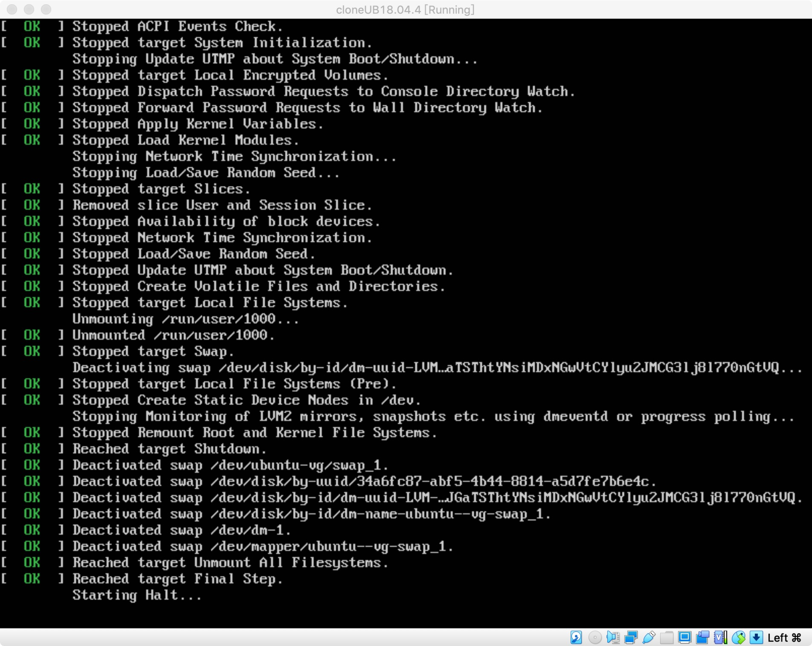
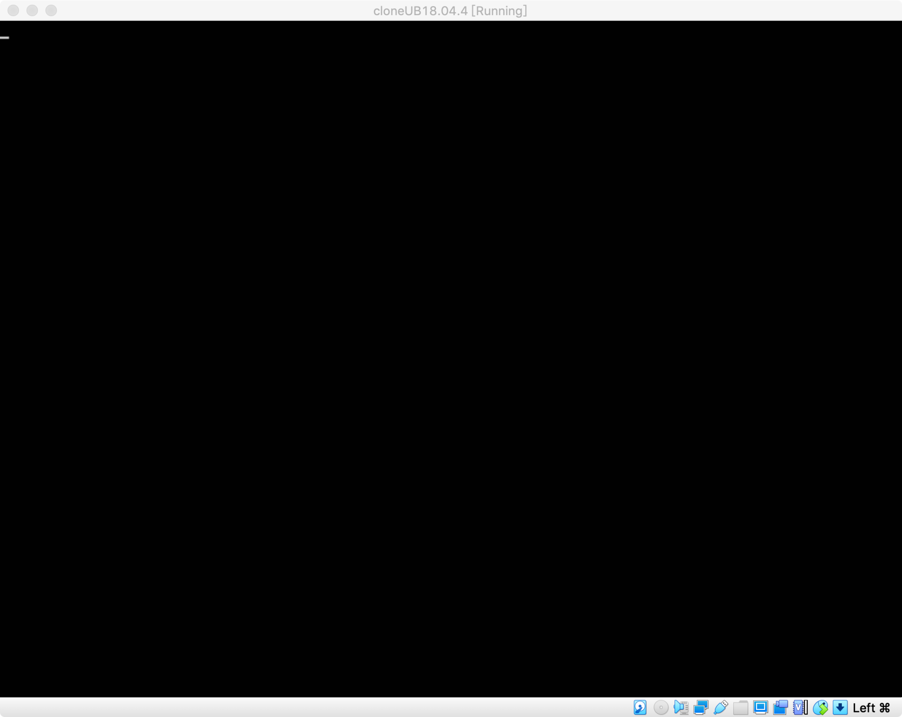
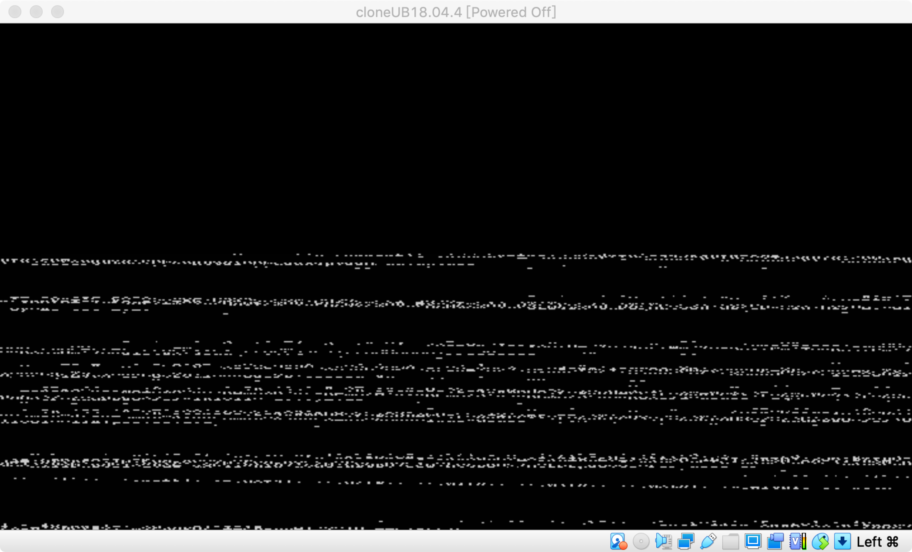
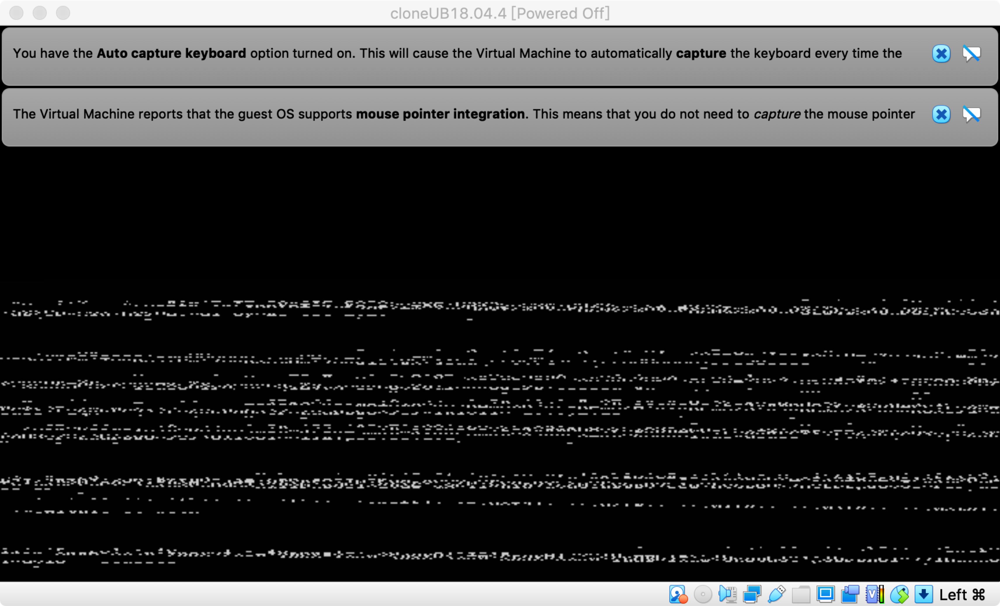
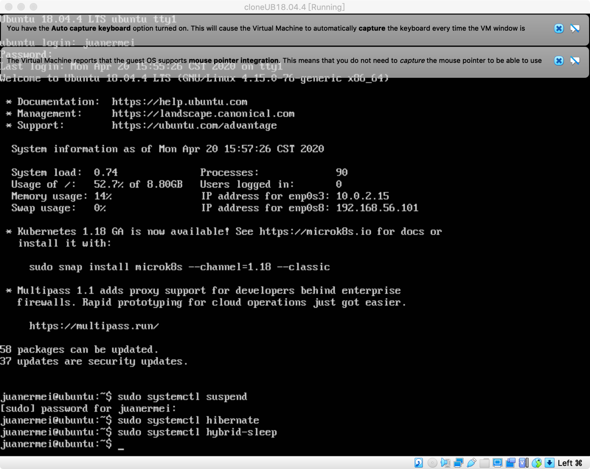
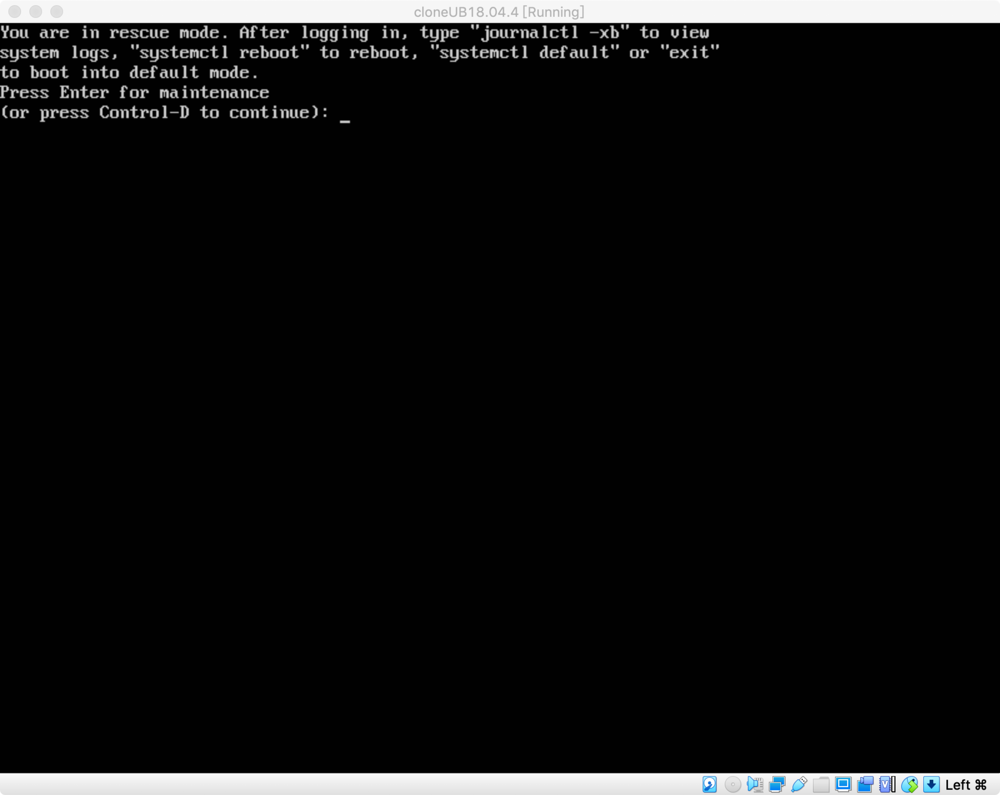

# 实验三：动手实战System
## 实验名称：动手实战System


## 实验要求：
- Systemd 入门教程：命令篇 by 阮一峰的网络日志  
- Systemd 入门教程：实战篇 by 阮一峰的网络日志  
- 参照第2章作业的要求，完整实验操作过程通过asciinema进行录像并上传，文档通过github上传。  
- 完成本章自查清单
***  

## 实验环境：
- Ubuntu 18.04.4 Server 64bit  
- mac os  
- asciinema
- VirtualBox
***
## 实验步骤：
### 一.命令篇   
>__系统管理：__  
>- Systemd版本：systemd 237   
>>*CPU停止工作：  
  
*暂停系统：  
  
（*按esc可退出暂停*）  
*让系统进入冬眠状态：   
  

*让系统进入交互式休眠状态：  
  

*启动进入救援状态（单用户状态）：  
  
 （*这一部分用录屏不方便展示，故用截图展示；重启系统和关闭系统，切断电源无法用截图表示*）  

__*录屏：*__  
>[系统管理]（https://asciinema.org/a/321943）   
[Unit]（https://asciinema.org/a/321952）  
[Unit的配置文件]（https://asciinema.org/a/321953）  
[Target]（https://asciinema.org/a/321954）  
[日志管理]（https://asciinema.org/a/321961）
### 二.实战篇
>[实践]（https://asciinema.org/a/321966）  

### 三.自查清单
>* 如何添加一个用户并使其具备sudo执行程序的权限  
```json  
#添加用户  
adduser 「username」

#赋予root权限  
sudo usermod -a -G sudo 「username」 或 sudo adduser 「username」 sudo
```
>* 如何将一个用户添加到一个用户组  
```json  
sudo usermod -a -G 「groupname」 「username」
```
>* 如何查看当前系统的分区表和文件系统详细信息？
```json  
 #查看分区表  
 sudo fdisk -l 或 sudo sdisk -l  

 #查看文件系统详细信息  
 df -a
```  
>* 如何实现开机自动挂载Virtualbox的共享目录分区？
```json    
#在Virtualbox的共享文件夹中添加本地文件，勾选自动挂载和固定分配

#将sr0挂载到/media/cdrom中  
sudo mount /dev/sr0 /media/cdrom

#配置升级
sudo apt-get update
sudo apt-get install build-essential gcc make perl dkms  

#安装增强功能并重启  
sudo /media/cdrom/./VBoxLinuxAdditions.run  
reboot  

#检验是否安装成功  
lsmod | grep vboxsf

#创建共享目录  
sudo mkdir /mnt/share

将本地文件夹挂载到指定目录  
sudo mount -t vboxsf juanfile /mnt/shard
``` 
>* 基于LVM（逻辑分卷管理）的分区如何实现动态扩容和缩减容量？
```json    
#扩容  
lvextend -L +size /dev/dir
#缩减容量  
lvextend -L -size /dev/dir
```  
>* 如何通过systemd设置实现在网络连通时运行一个指定脚本，在网络断开时运行另一个脚本?  
```json   
#打开相关的Unit后，在networking.service配置文件中添加: 
    ExecStart=「MY_SATART_SCRIPT_PATH」  
    ExecStop=「MY_STOP_SCRIPT_PATH」  

#重新加载配置文件     
    sudo systemctl daemon-reload
``` 
>* 如何通过systemd设置实现一个脚本在任何情况下被杀死之后会立即重新启动？实现杀不死？
```json    
 向配置文件里添加 Restart=always
 ```   
***  
## 参考资料
* [Systemd入门教程：命令篇]  
http://www.ruanyifeng.com/blog/2016/03/systemd-tutorial-commands.html  
* [Systemd入门教程：实战篇]  
http://www.ruanyifeng.com/blog/2016/03/systemd-tutorial-part-two.html
* [关于asciinema录屏上传失败的解决方案]  
https://github.com/asciinema/asciinema/issues/272
***