# 实验四：web服务器的搭建
## 实验要求：
- ### 基本要求
在一台主机（虚拟机）上同时配置Nginx和VeryNginx  
VeryNginx作为本次实验的Web App的反向代理服务器和WAF  
PHP-FPM进程的反向代理配置在nginx服务器上，VeryNginx服务器不直接配置Web站点服务  
使用Wordpress搭建的站点对外提供访问的地址为： http://wp.sec.cuc.edu.cn
使用Damn Vulnerable Web Application (DVWA)搭建的站点对外提供访问的地址为： http://dvwa.sec.cuc.edu.cn  
- ### 安全加固要求
使用IP地址方式均无法访问上述任意站点，并向访客展示自定义的友好错误提示信息页面-1  
Damn Vulnerable Web Application (DVWA)只允许白名单上的访客来源IP，其他来源的IP访问均向访客展示自定义的友好错误提示信息页面-2  
在不升级Wordpress版本的情况下，通过定制VeryNginx的访问控制策略规则，热修复WordPress < 4.7.1 - Username Enumeration  
通过配置VeryNginx的Filter规则实现对Damn Vulnerable Web Application (DVWA)的SQL注入实验在低安全等级条件下进行防护  
- ### VeryNginx配置要求
VeryNginx的Web管理页面仅允许白名单上的访客来源IP，其他来源的IP访问均向访客展示自定义的友好错误提示信息页面-3  
通过定制VeryNginx的访问控制策略规则实现：  
限制DVWA站点的单IP访问速率为每秒请求数 < 50  
限制Wordpress站点的单IP访问速率为每秒请求数 < 20  
超过访问频率限制的请求直接返回自定义错误提示信息页面-4  
禁止curl访问  
***  
## 实验环境：
- Ubuntu 18.04.4 Server 64bit  
- mac os  
***
## 实验步骤：
### 安装verynginx  
- 克隆 VeryNginx 仓库到本地, 然后进入仓库目录，执行以下命令  
```json  
 git clone https://github.com/alexazhou/VeryNginx.git  
 cd VeryNginx  
 python install.py install  
``` 
- 根据报错安装需要的依赖(libssl-dev)，然后重新运行上述语句进行安装  
- 修改VeryNginx配置文件，修改用户名和监听端口，修改主机host文件
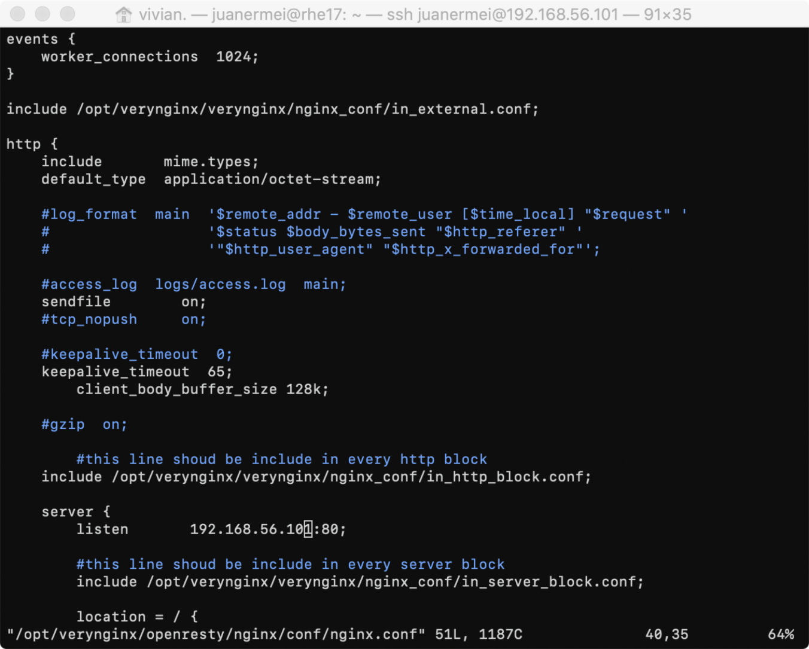 
  
（访问VeryNginx页面请见`遇到的问题及解决方案`）

### 安装nginx  
```json  
#安装nginx
sudo apt install nginx

``` 
- 配置安装mysql数据库  
```json  
#下载安装mysql数据库
sudo apt install mysql-server
#配置
sudo mysql_secure_installation
```  
- 配置安装php  
```json  
#安装php
sudo add-apt-repository universe
sudo apt install php-fpm php-mysql  

#修改nginx配置PHP-FPM进程的反向代理配置在nginx服务器上 保存退出
sudo vim /etc/nginx/sites-enabled/default
   location ~ \.php$ {
         include snippets/fastcgi-php.conf;
          fastcgi_pass unix:/var/run/php/php7.2-fpm.sock;
     }
     
#重新启动nginx使配置生效
sudo systemctl restart nginx
```

### wordpress安装  
- 下载wordpress4.7安装包
```json  
#首先下载安装包
sudo wget https://wordpress.org/wordpress-4.7.zip

#安装unzip  
sudo apt install unzip

#解压安装包cd 
unzip wordpress-4.7.zip

#将解压后的wordpress移到指定路径
sudo mkdir /var/www/html/wp.sec.cuc.edu.cn
sudo cp -r  wordpress /var/www/html/wp.sec.cuc.edu.cn
```

- 在mysql中新建一个数据库用于wordpress的数据库支撑
```json  
# 登录mysql的root账户
mysql -u root -p

#新建一个数据库wordpress
CREATE DATABASE wordpress DEFAULT CHARACTER SET utf8 COLLATE utf8_unicode_ci;

#新建一个用户 刷新并退出
GRANT ALL ON wordpress.* TO 'wordpressuser'@'localhost' IDENTIFIED BY 'password';
FLUSH PRIVILEGES;
EXIT; 
```
- 安装php扩展
```json
#安装
sudo apt update
sudo apt install php-curl php-gd php-intl php-mbstring php-soap 
```

- 配置nginx
```json
#修改nginx配置 
sudo vim /etc/nginx/sites-enabled/default

#将网站根站点修改为wordpress的安装目录 并保存退出
root /var/www/html/wp.sec.cuc.edu.cn;
```

- 实现用域名http://wp.sec.cuc.edu.cn访问
```json
#修改/etc/nginx/sites-available/default的server_name
sudo vim /etc/nginx/sites-available/default
server_name wp.sec.cuc.edu.cn;
#在虚拟机的/etc/hosts和本机etc\hosts文件中添加以下内容
192.168.56.101 wp.sec.cuc.edu.cn
```
- 添加matcher和up stream和proxy pass  
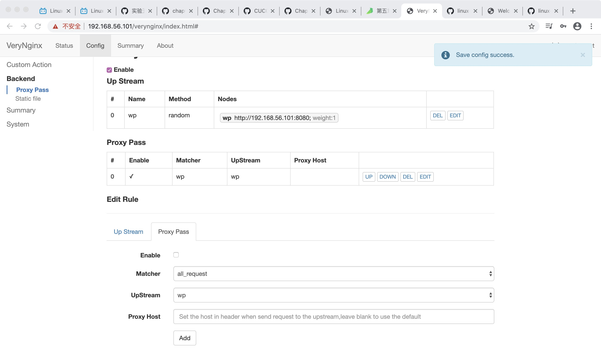 

### 安装DVWA  
- 首先下载DVWA，并移动到指定文件夹中,执行完毕后 /var/www/html文件夹下会有一个DVWA的子文件夹。
```json
sudo git clone https://github.com/ethicalhack3r/DVWA /tmp/DVWA
sudo mv /tmp/DVWA /var/www/html
```

- 重命名DVWA中的**/config/config.inc.php.dist为/config/config.inc.php**
```json
sudo cp /var/www/html/DVWA/config/config.inc.php.dist /var/www/html/DVWA/config/config.inc.php
```

- 在mysql为DVWA新建一个用户名, 修改DVWA中的配置,用于连接mysql数据库
```json
#首先登陆mysql
#新建一个数据库dvwa
 CREATE DATABASE dvwa DEFAULT CHARACTER SET utf8 COLLATE utf8_unicode_ci;

#新建一个用户dvwauser，分配管理dvwa的权限，设置密码 刷新并退出
 GRANT ALL ON dvwa.* TO 'dvwauser'@'localhost' IDENTIFIED BY 'p@ssw0rd';
 FLUSH PRIVILEGES;
 EXIT;
#重启mysql生效
sudo systemctl restart mysql
 
#打开DVWA的配置文件
 sudo vim /var/www/html/DVWA/config/config.inc.php
 
#修改配置文件为自己需要的内容 保存退出
 $_DVWA[ 'db_server' ]   = '127.0.0.1';
 $_DVWA[ 'db_database' ] = 'dvwa';
 $_DVWA[ 'db_user' ]     = 'dvwauser';
 $_DVWA[ 'db_password' ] = 'p@ssw0rd';
```

- 修改php的配置
```json
#修改配置文件 并保存退出
sudo vim /etc/php/7.2/fpm/php.ini

#作以下修改
allow_url_include = on
allow_url_fopen = on
safe_mode = off
magic_quotes_gpc = off
display_errors = off

#修改完以后重启php-fpm使配置生效
sudo systemctl restart php7.2-fpm
```

- 设置DVWA文件夹访问权限
```json
sudo chown -R www-data.www-data /var/www/html/DVWA
```

- 配置nginx 5566端口监听DVWA的访问
```json
#打开nginx配置文件
sudo vim /etc/nginx/sites-enabled/default

#添加对应的监听模块
server {
        listen 5566；
        root /var/www/html/DVWA;
        index index.html setup.php index.htm index.php index.nginx-debian.html;
         location / {
                try_files $uri $uri/ =404;
          }
        #配置php-fpm反向代理
        location ~ \.php$ {
                include snippets/fastcgi-php.conf;
                fastcgi_pass unix:/var/run/php/php7.2-fpm.sock;
        }
    }

# 设置软链接
sudo ln -s /etc/nginx/sites-available/${DVWA_DOMAIN} /etc/nginx/sites-enabled/

#重启nginx使配置生效
sudo systemctl restart nginx
```
- 在主机hosts文件中增加一条对应的dns解析 `169.254.134.150 dvwa.sec.cuc.edu.cn`
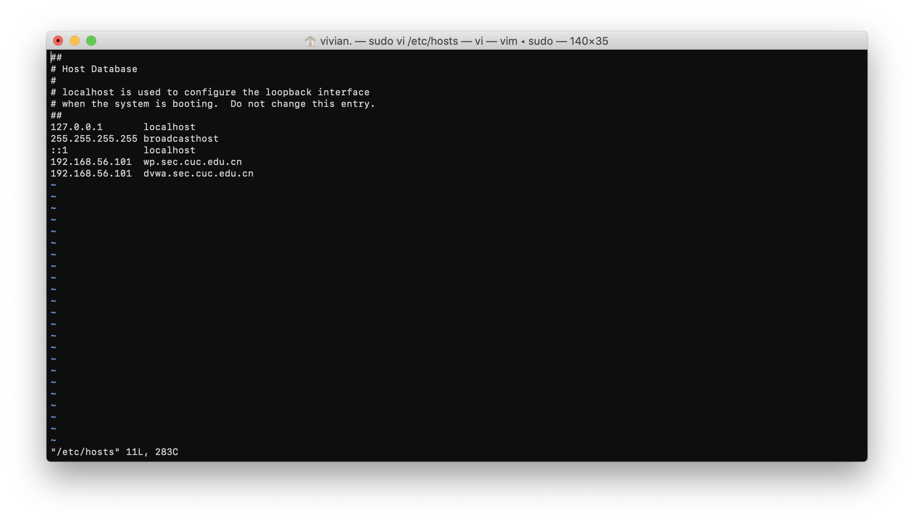   
***  
## 遇到的问题及解决方案  
### 问题描述：
* 安装VeryNginx失败
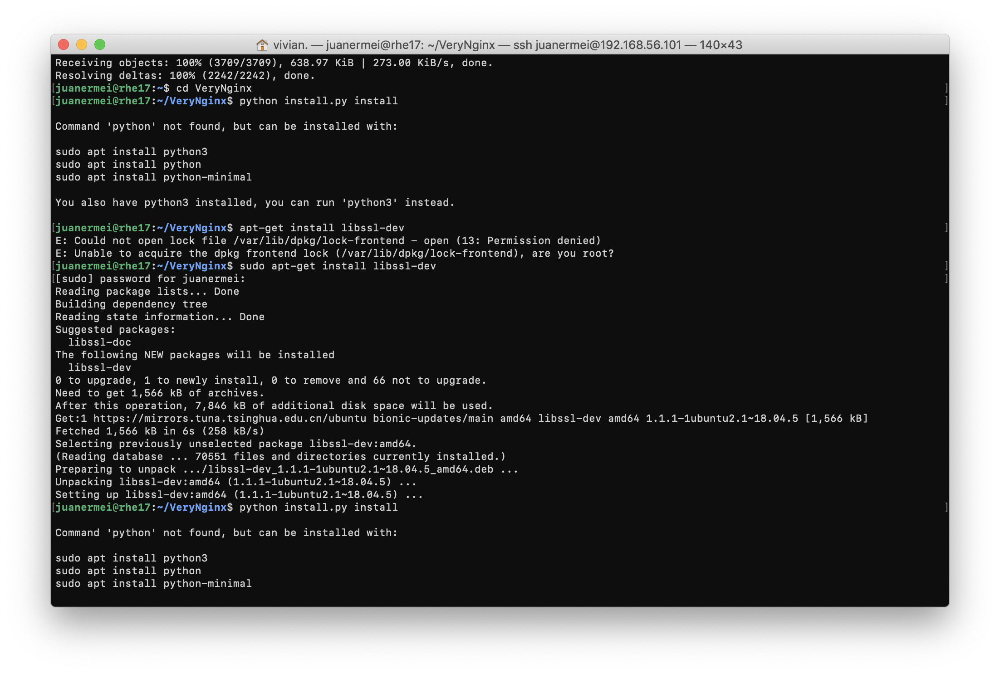   
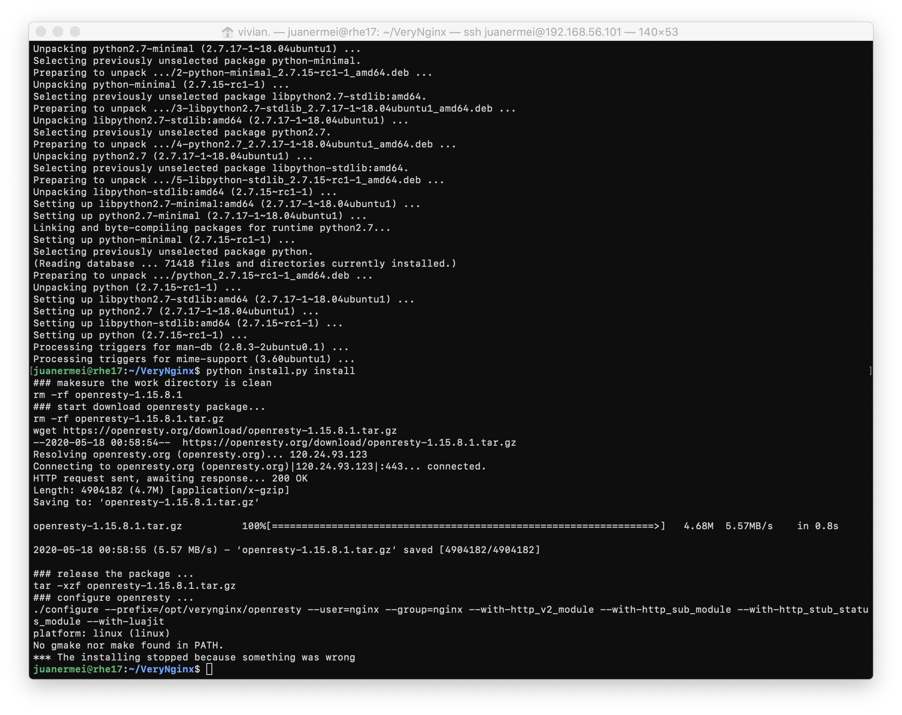  
### 解决方案：  
安装依赖包  
`sudo apt install libssl-dev`  
`sudo apt install libpcre3 libpcre3-dev`  
安装`make`  
 `sudo apt install make`  
安装`gcc`  
`sudo apt install gcc`  
安装`Zlib`  
`sudo apt-get install zlib1g.dev`  
安装`python`  
`sudo apt-get install python`  
重新安装VeryNginx
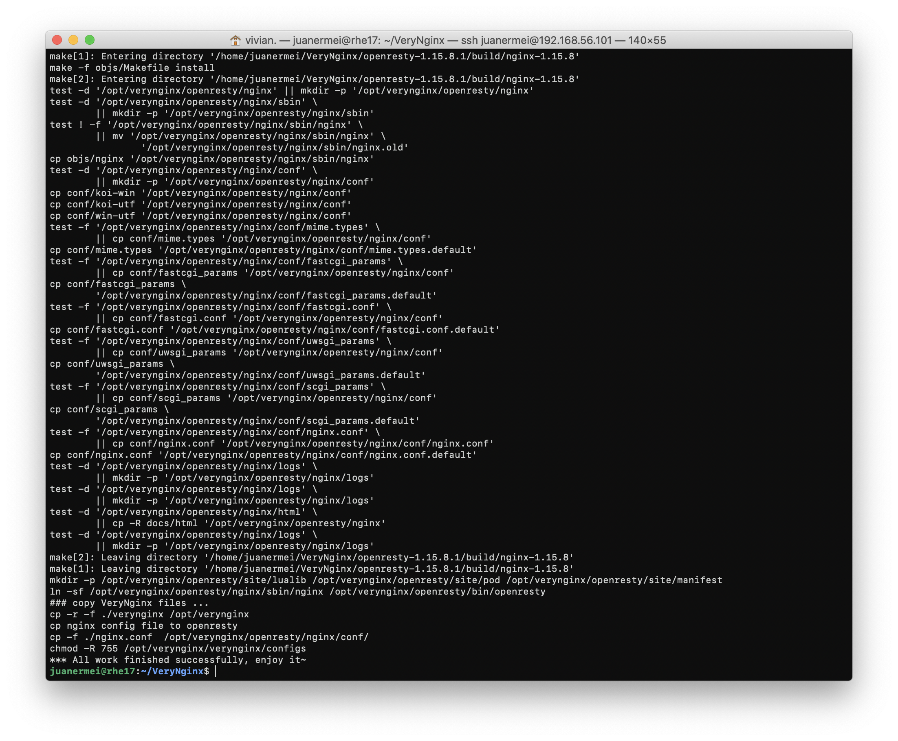 
***
### 问题描述：
* 在nginx.conf和主机的host文件中都做了教学视频中的相应修改，但是访问域名（192.168.56.101）却没有访问到VeryNginx，而是得到如下界面
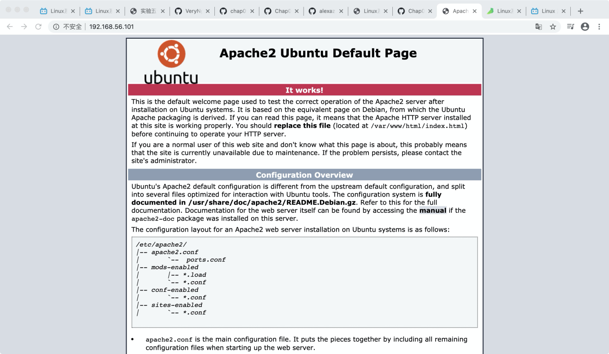 
### 解决方案：
将占用80端口的apache2进程结束，并开启nginx进程，即可通过域名成功访问VeryNginx页面

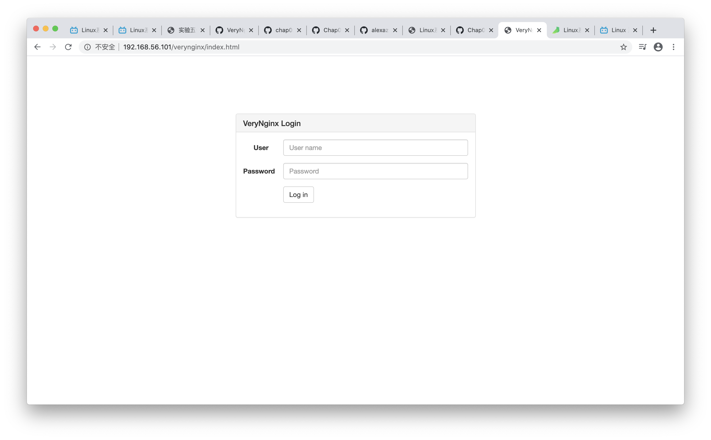  
***
### 问题描述：
* 无法启动nginx，nginx总是需要占80和8080两个窗口
### 解决方案： 
在启用站点和可用站点都存在配置文件，其中启用站点的为其快捷方式，而我只修改了启用站点的配置文件，导致nginx总是要占用两个窗口
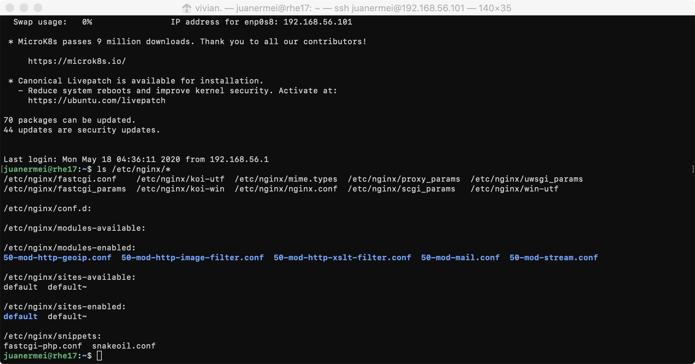
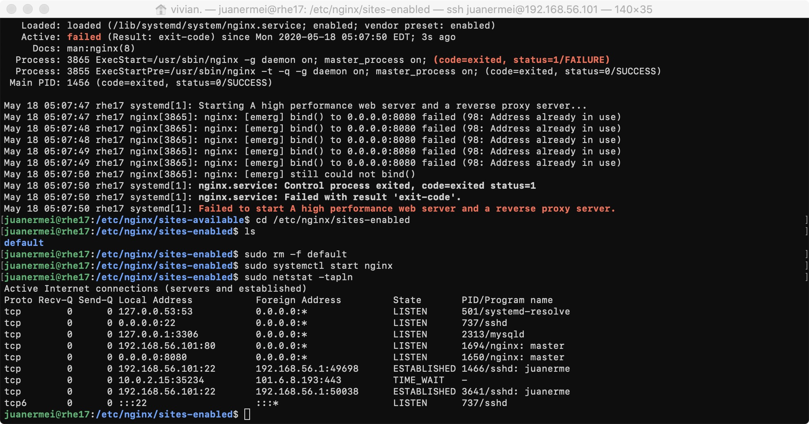  
***
### 问题描述：
* 无法登陆mysql的root用户
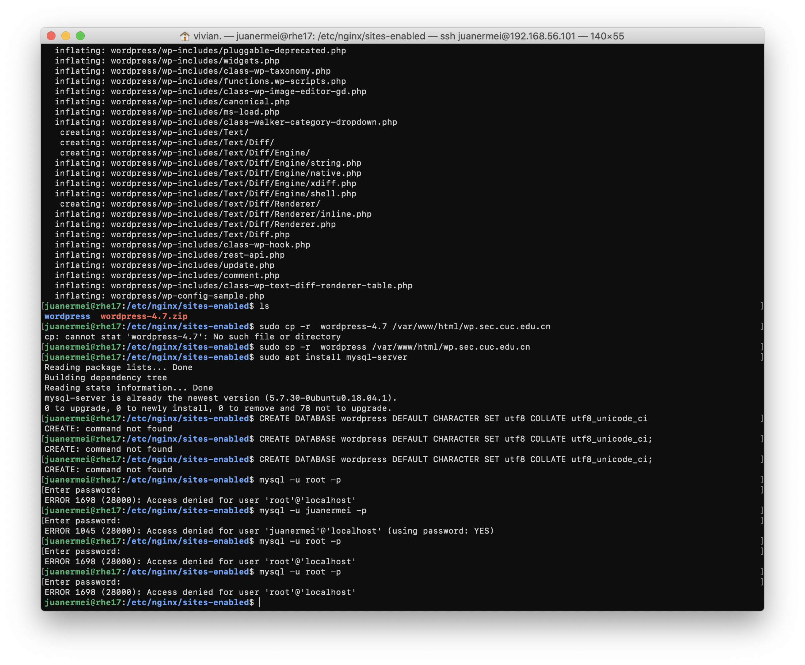  
### 解决方案： 
```json
#修改mysqld.cnf配置文件
sudo vim /etc/mysql/mysql.conf.d/mysqld.cnf
加入`skip-grant-tables`

#重启mysql
sudo service mysql restart

但是跳过输入密码进入mysql无法执行mysql中的部分操作,故需执行以下操作

mysql -u root -p
#直接回车

use mysql;
update user set authentication_string=password("你的密码") where user="root";
flush privileges;
```
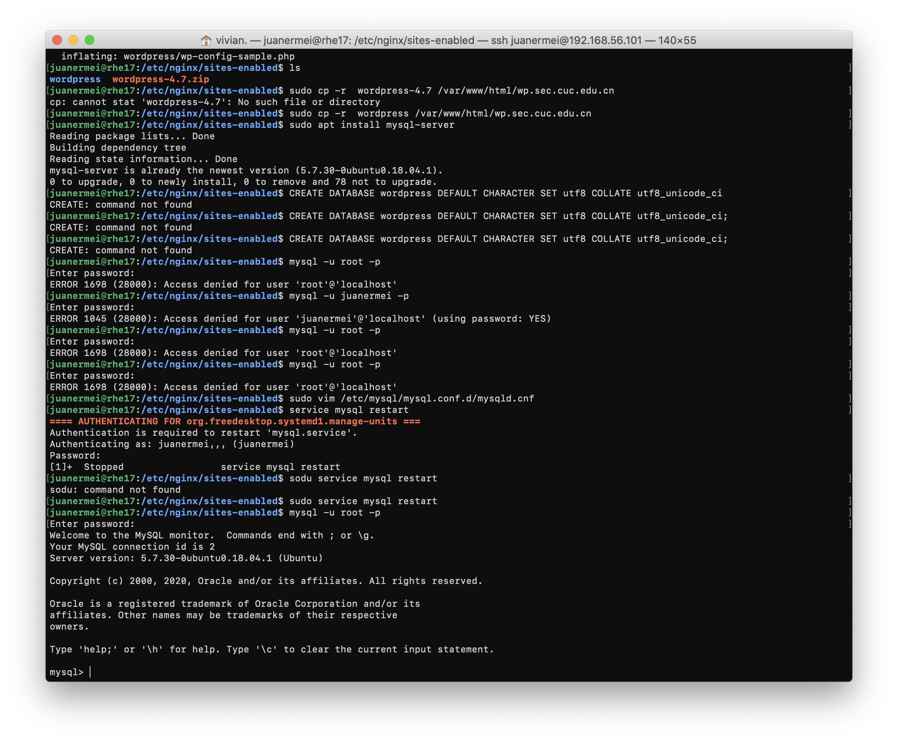
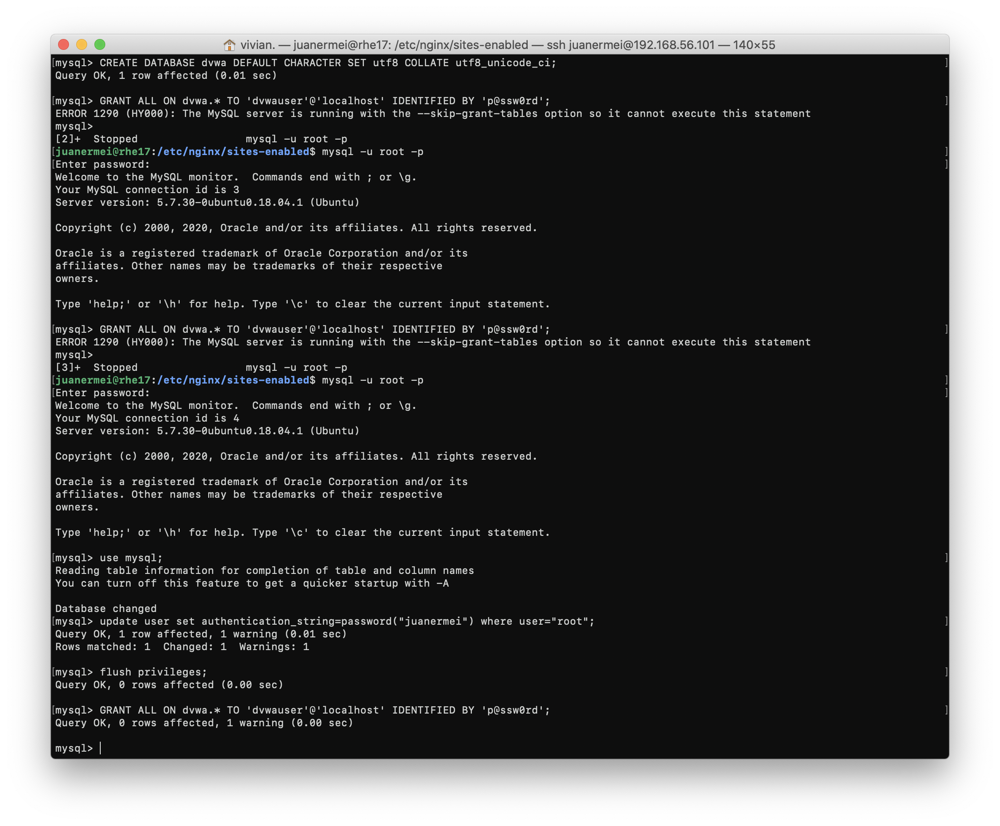
***
### 问题描述：
* 无法实现用域名http://wp.sec.cuc.edu.cn/访问wordpress
  
### 解决方案： 
## 参考资料
* [安装DVWA]（How to Install and Configure DVWA Lab on Ubuntu 18.04 server）
* [mysql出现ERROR1698(28000)的解决方法]（https://www.cnblogs.com/cpl9412290130/p/9583868.html）
* [安装WordPress]（How To Install WordPress with LEMP on Ubuntu 18.04）
* [mac修改host]（https://www.jianshu.com/p/fa41e05fe2d3）
* [linux-2020-isZXY]（https://github.com/CUCCS/linux-2020-isZXY/pull/8/files）
* [linux-2019-jackcily]（https://github.com/CUCCS/linux-2019-jackcily/pull/5/files?short_path=98bd81e#diff-98bd81e028e11b2e227d23c8ffb15023）
***