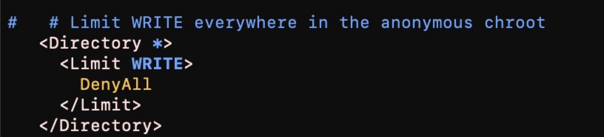
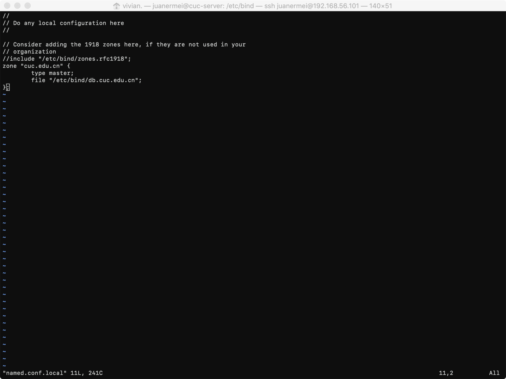
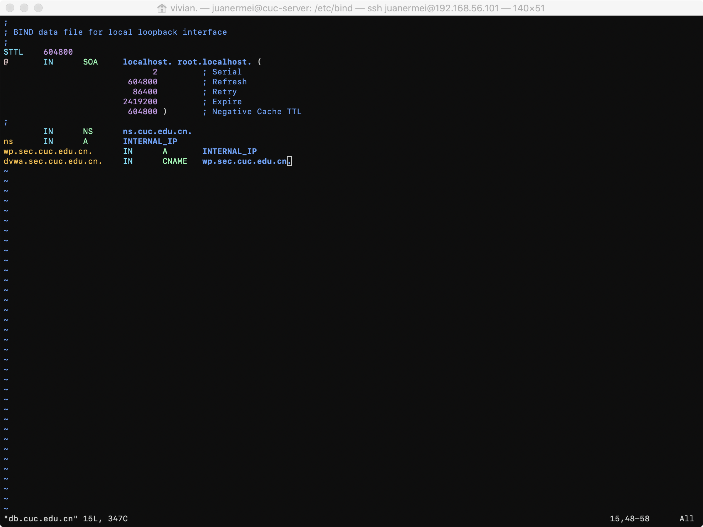
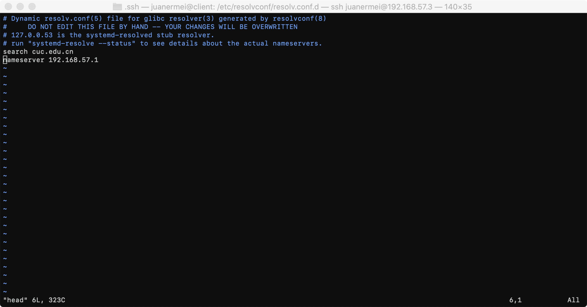
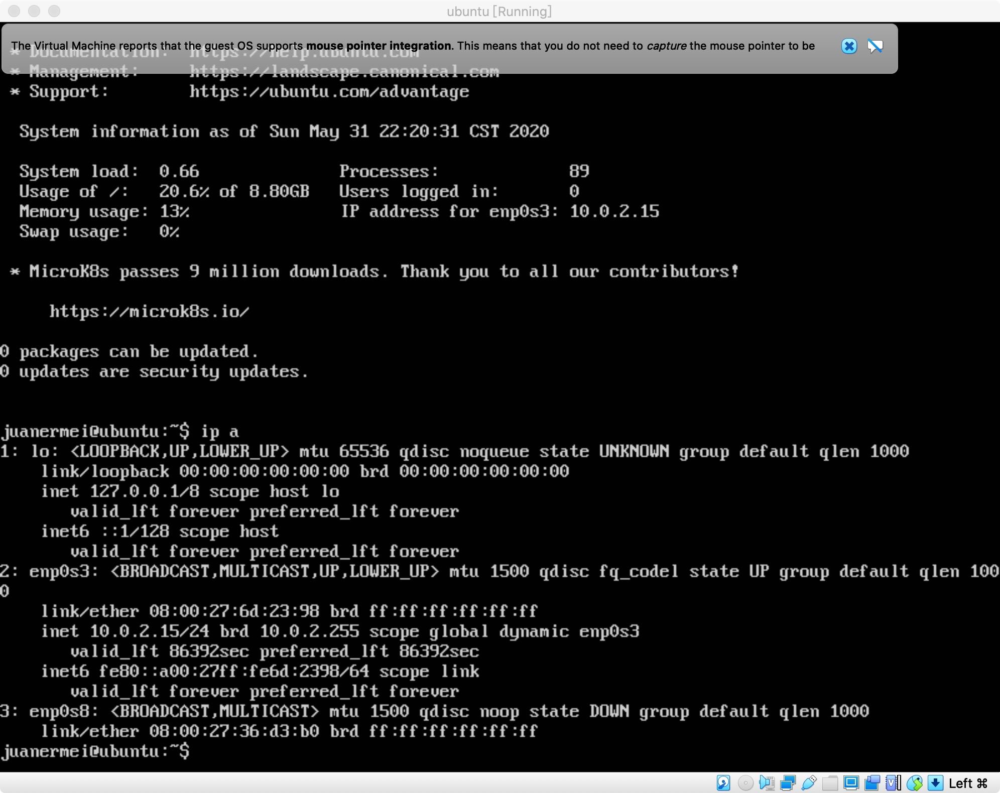

# 实验四：shell脚本编程练习进阶  
## 实验环境：
- Ubuntu 18.04.4 Server 64bit  
- mac os  
- 工作主机：192.168.56.101 juanermei@cuc-server
- 目标主机：192.168.57.3 root@client
***
## 实验要求
FTP、NFS、DHCP、DNS、Samba服务器的自动安装与自动配置
- 目标测试与验证系统为本学期课程指定操作系统版本  
- 自动安装与自动配置过程的启动脚本要求在本地执行  
*提示：配置远程目标主机的SSH免密root登录，安装脚本、配置文件可以从工作主机（执行启动脚本所在的主机）上通过scp或rsync方式拷贝或同步到远程目标主机，然后再借助SSH的远程命令执行功能实现远程控制安装和配置*  
- 假设目标系统没有配置过root用户免密登录，所以我们要求在自动安装脚本中包含自动配置远程root用户免密登录的代码  
- 脚本在执行过程中，如果需要在目标主机上创建目录、创建临时文件、执行网络下载等操作需要判断执行是否成功，并进行必要的异常处理（*例如：apt-get update失败，则退出脚本执行，并将友好错误信息打印在控制台上。临时目录不存在，则自动创建该临时目录*）  
- 所有服务的配置文件、临时目录需设置正确的目录和文件归属和权限位，禁止使用777这种偷懒的权限位设置  
- 减少不必要的安装过程中的人机交互输入，尽可能全部通过脚本的方式完成选项设置和交互式问题输入等  
- 目标环境相关参数应使用独立的配置文件或配置脚本（*在主调脚本中引用配置脚本*）  
        目标服务器IP  
        目标服务器SSH服务的端口  
        目标服务器上使用的用户名  
        目标服务器上用于临时存储安装脚本、配置文件的临时目录路径  
***
## 实验步骤：
### 启用第二台虚拟机并配置网卡  
- 新建一台虚拟机，并为其添加一张网卡并手动配置  
### 配置工作主机到目标主机的远程SSH root用户登陆  
- 工作主机操作：
```json  
# 在工作主机生成ssh-key
ssh-keygen -b 4096
#工作主机通过ssh-copy-id方式导入ssh-key 
ssh-copy-id -i ~/.ssh/id_rsa.pub root@192.168.57.3  
#修改主机名便于分辨，将工作主机名改为cuc-server，并将目标主机改名为client
sudo hostnamectl set-hostname newname
```  
### FTP：proftpd
* 安装proftpd  
  `sudo apt-get update`  
  `sudo apt-get install proftpd`
* 要求
  *  配置一个提供匿名访问的FTP服务器，匿名访问者可以访问1个目录且仅拥有该目录及其所有子目录的只读访问权限；
  * 具体步骤  
   1.编辑 /etc/proftpd目录下的proftpd.conf文件  
   `sudo vim  /etc/proftpd/proftpd.conf`  
   2.创建共享文件夹  
   `sudo mkdir ftp`  
   3.更改用户共享目录  
   `sudo chown -R ftp:nogroup ~/ftp`  
   `sudo usermod -d /home/ftp ftp`
 *  配置一个支持用户名和密码方式访问的账号，该账号继承匿名访问者所有权限，且拥有对另1个独立目录及其子目录完整读写（包括创建目录、修改文件、删除文件等）权限（该账号仅可用于FTP服务访问，不能用于系统shell登录）
* 具体步骤：  

1.编辑 /etc/proftpd目录下的proftpd.conf文件  
   `sudo vim  /etc/proftpd/proftpd.conf`  
    添加以下内容:  
 ```json
        PersistentPasswd off
        AuthUserFile /usr/local/etc/proftpd/passwd
        AuthGroupFile /usr/local/etc/proftpd/group
        AuthOrder mod_auth_file.c mod_auth_unix.c
```       
2.新建passwd和group文件夹  
```json
        #先创建一个名为user1的目录  
        sudo mkdir user1  
        #再创建两个用户user1和user2  
        sudo ftpasswd --passwd --file=/usr/local/etc/proftpd/passwd --name=user1 --uid=1024 --home=/home/user1 --shell=/bin/false  
        #创建一个用户组virtualusers  
        sudo ftpasswd --file=/usr/local/etc/proftpd/group --group --name=virtualusers --gid=1024  
        #将创建的两个用户添加到新创建的用户组virtualusers  
        sudo ftpasswd --group --name=virtualusers --gid=1024 --member=user1 --member=user2 --file=/usr/local/etc/proftpd/group  
```  
3.修改权限，改变指定目录以及对其子目录下的所有文件的权限  
    `sudo chown -R 1024:1024 /home/user1`  
    `sudo chmod -R 700 /home/user1`  
 
* FTP用户不能越权访问指定目录之外的任意其他目录和文件  
  编辑 /etc/proftpd目录下的proftpd.conf文件  
  `sudo vim  /etc/proftpd/proftpd.conf`

* 匿名访问权限仅限白名单IP来源用户访问，禁止白名单IP以外的访问
  * 具体步骤:  
   1.编辑 /etc/proftpd目录下的proftpd.conf文件  
    `sudo vim  /etc/proftpd/proftpd.conf`  
   2.添加以下内容，即IP在白名单中的192.168.92.101可以对ftp服务器进行访问，白名单外的IP不能访问   
   
proftpd.conf文件:


### NFS  
* 在1台Linux上配置NFS服务，另1台电脑上配置NFS客户端挂载2个权限不同的共享目录，分别对应只读访问和读写访问权限
*  Host
      *  IP：192.168.56.101
      *  配置NFS服务  
        `sudo apt-get install nfs-kernel-server`  
      *  创建一个用于挂载的（可读写）文件夹  
        `sudo mkdir /var/nfs/general -p`  
        `sudo chown nobody:nogroup /var/nfs/general`  
      *  修改/etc/exports文件（即NFS服务的主要配置文件）  
        `/var/nfs/general 192.168.57.3(rw,sync,no_subtree_check)`   
        `/home 192.168.57.3(sync,no_root_squash,no_subtree_check)` 
          
*  Client
      *  IP：192.168.57.3
      *  配置NFS服务  
         `sudo apt-get update`  
         `sudo apt-get install nfs-common`
      *  创建相应的挂载文件  
         `sudo mkdir -p /nfs/general`  
         `sudo mkdir -p /nfs/home`
      *  挂载文件夹  
         `sudo service nfs-kernel-server restart`  
         `sudo mount 192.168.56.101:/var/nfs/general /nfs/general`
### DHCP
* 编辑工作主机的/etc/network/interfaces文件  

* 编辑工作主机的/etc/default/isc-dhcp-server文件,添加：  
`INTERFACES="enp0s9"`
* 编辑server的/etc/dhcp/dhcpd.conf文件  

### DNS
*  Host
      *  IP：192.168.56.101
      *  下载安装bind9  
        `sudo apt-get install bind9`
      *  编辑 /etc/bind/named.conf.local文件
        
      *  创建db文件  
        `sudo cp /etc/bind/db.local /etc/bind/db.cuc.edu.cn`   
      *  编辑 /etc/bind/db.cuc.edu.cn文件
        
      *  启动服务器
        `sudo service bind9 start`

*  Client
      *  IP：192.168.57.3
      * 安装resolvconf
        `sudo apt-get update && sudo apt-get install resolvconf`
      *  编辑 /etc/resolvconf/resolv.conf.d/head文件  
        
      *  更新resolv.conf文件  
        `sudo resolvconf -u`
### Samba
* Server：Linux & Client：Mac OS  
*  server  
   * 下载安装Samba  
        `sudo apt-get install samba`  
   *  创建Samba共享用户  
        `sudo useradd -M -s /sbin/nologin juanermei2`  
        `sudo passwd juanermei2`  
   *  创建和Samba共享用户同名的linux 用户  
        `sudo smbpasswd -a juanermei2`           
   *  在 samba配置文件，即/etc/samba/smb.conf 文件尾部添加以下配置，guest为匿名用户可以访问的目录（不可写），demo为虚拟用即户才能访问的目录（可读写）
        
   *   恢复一个samba用户  
        `smbpasswd -e smbuser`  
   *   创建用户组  
        `sudo groupadd smbgroup`  
        `sudo usermod -G smbgroup smbuser`  
   *  创建共享文件夹和更改用户组  
        `mkdir -p ~/samba/guest/`  
        `mkdir -p ~/samba/demo/`  
        `sudo chgrp -R smbgroup ~/samba/guest/`   #改变目录文件所属的用户组  
        `sudo chgrp -R smbgroup ~/samba/demo/`  
        `sudo chmod 2775 ~/samba/guest/`   #修改共享目录权限  
        `sudo chmod 2770 ~/samba/demo/`  
   * 启动Samba服务  
        `smbd`
 *  client
    *  下载安装Samba
        `sudo apt install samba`
    *   在浏览器上访问需要用户名密码的可读写文件：\\192.168.57.7\demo
    *   在浏览器上访问可匿名访问的不可读写文件：\\192.168.57.7\guest
***  
## 遇到的问题及解决方案  
### 问题描述：
* 目标主机启用第二块网卡失败
 
### 解决方案：    
* 执行命令：`sudo dhclient enp0s8`  
 
***
 ### 问题描述：
* 设置root用户免密登陆失败
 
### 解决方案：    
* 先对目标主机的普通用户进行免密登陆设置，然后在目标主机上将普通用户~/.ssh目录下的authorized_keys文件复制到root用户的~/.ssh目录下，然后执行`chown root:root *`
 
***
## 参考资料
* [Ubuntu安装搭建ProFTPd服务器](https://www.linuxidc.com/Linux/2012-12/77113.htm)
* [网络资源共享](https://github.com/CharleneTan/linux/blob/master/2017-1/TJY/%E7%BD%91%E7%BB%9C%E8%B5%84%E6%BA%90%E5%85%B1%E4%BA%AB/%E7%BD%91%E7%BB%9C%E8%B5%84%E6%BA%90%E5%85%B1%E4%BA%AB.md)
* [CUCCS/linux-2020-pengmingxiao3759](https://github.com/CUCCS/linux-2020-pengmingxiao3759/pull/9/files?file-filters%5B%5D=.conf&file-filters%5B%5D=.md&file-filters%5B%5D=.png&file-filters%5B%5D=.sh)
* [CUCCS/linux-2020-Beautifullyl](https://github.com/CUCCS/linux-2020-Beautifullyl/pull/6/files?file-filters%5B%5D=.cn&file-filters%5B%5D=.md&file-filters%5B%5D=.png)
***